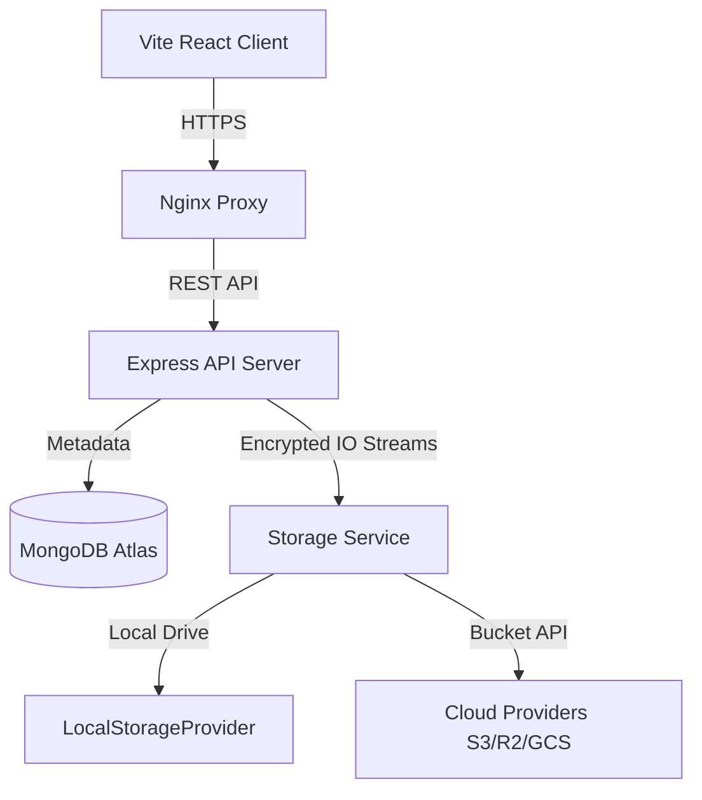

# System Architecture Design

## Architecture Overview
AetherVault is structured into isolated layers separating the database models, API gateways, storage wrappers, and background worker queues.

## Key Layers
*   **API Routing & Security Gateways**: Restricts endpoints using JWT token parsers and express rate limit constraints.
*   **Encrypted IO Pipeline**: Pipes file streams directly through AES-256 ciphers to the designated storage provider.
*   **Job Services**: Dispatches non-blocking async tasks (scaling thumbnails, scanning viruses).
