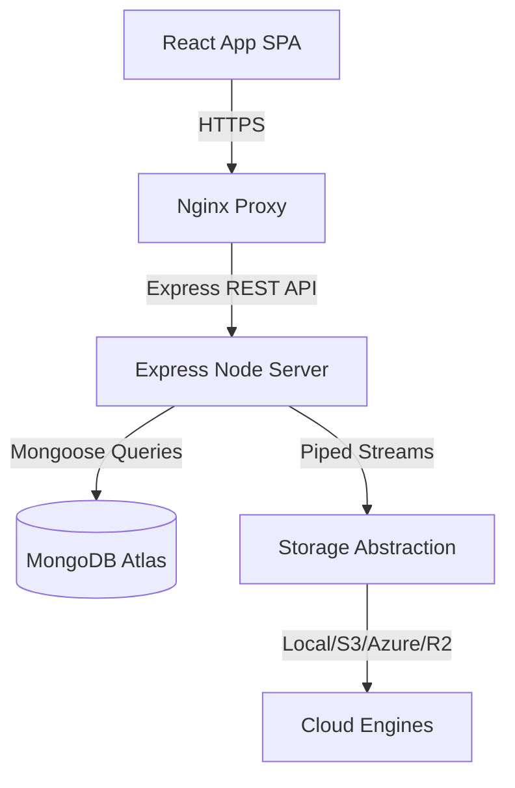

# AetherVault

[](LICENSE)
[](actions)
[](contributors)

AetherVault is an enterprise-grade cloud workspace and secure multi-user storage manager comparable to Google Drive, Dropbox, and OneDrive.

## 🚀 Key Features

| Feature | Description | Support |
|---|---|---|
| **Zero-Knowledge Cipher** | Direct file encrypt/decrypt stream pipelines | Active |
| **Workspace Scoping** | Switch between Personal, Team, and Department drives | Active |
| **AI Intelligent Search** | Query files semantically or trigger document summaries | Active |
| **Desktop Interactions** | F2 inline rename, drag-and-drop transfers, shortcuts | Active |

## 📐 Architecture


## 🛠️ Installation & Getting Started
Install dependencies and trigger the developer server:
```bash
# Set up backend
cd backend && npm install
# Set up frontend
cd ../frontend && npm install
# Startup
npm run dev
```

## 🗺️ Roadmap
*   [x] Version 7.5: Concurrency locks & file synchronization triggers.
*   [x] Version 8.0: Commercial health checks & production liveness diagnostics.
*   [ ] Future Scope: Hardware Security Module (HSM) decryption vaults.

## 🤝 Contributing
Contributions are welcome! Please read our [CONTRIBUTING.md](CONTRIBUTING.md) and [CODE_OF_CONDUCT.md](CODE_OF_CONDUCT.md) first.
